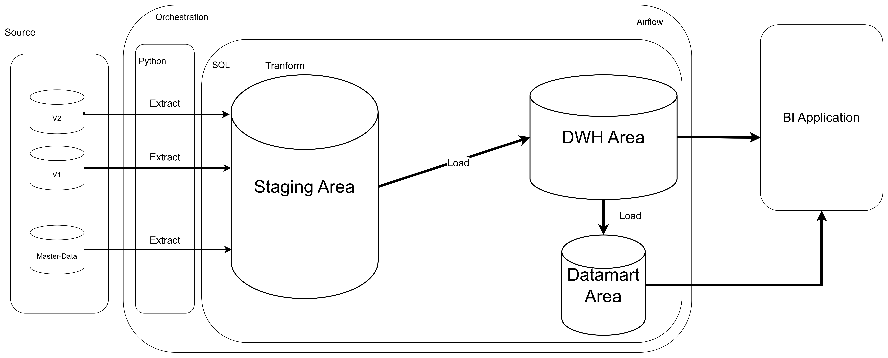
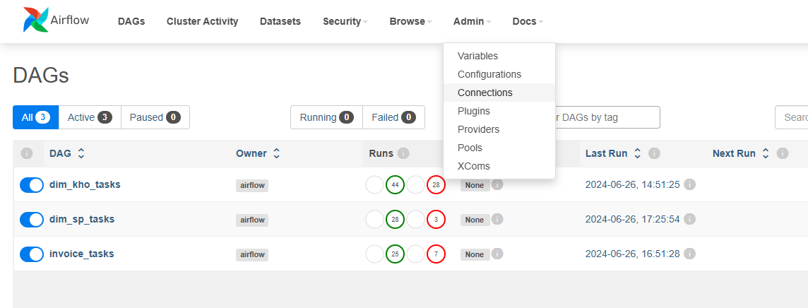
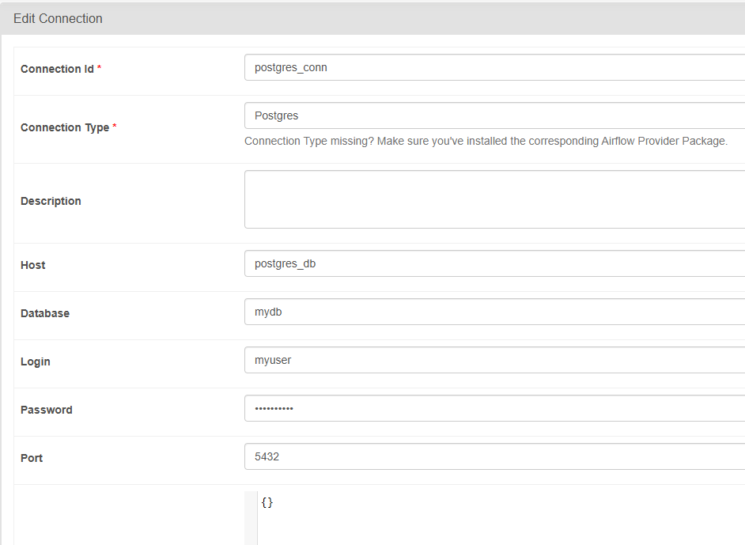
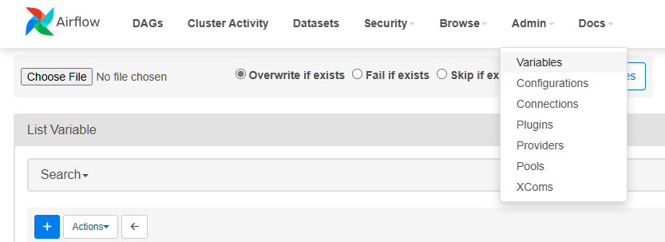
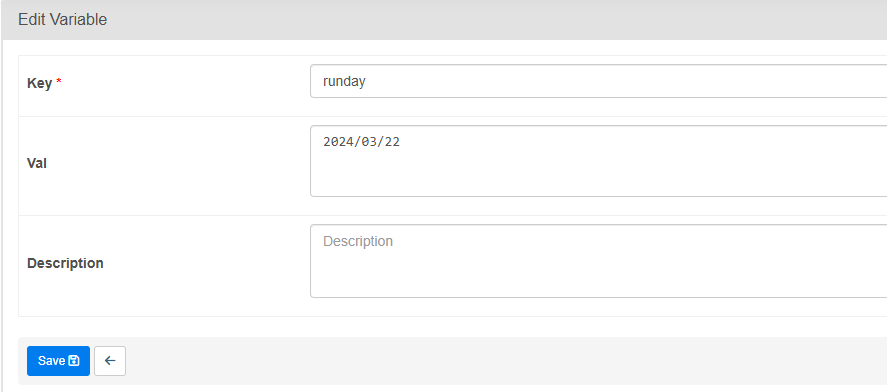

## Bài toán:

Giải pháp hệ thống Data Warehouse cho doanh nghiệp bán lẻ

## Kiến trúc hệ thống



## Khởi tạo hệ thống
0. Khởi tạo môi trường 

| python | 3.11.3 |
|--------|--------|
| docker | 24.0.5 |

- Khởi động docker service 
- Nếu máy chưa được cài đặt docker, thực hiện cài đặt qua link nếu hệ điều hành là Ubuntu [Docker_Install_Link](https://docs.docker.com/engine/install/ubuntu/)
1. Tạo custom image
    > docker build -f Dockerfile -t airflow-custom:latest .
- Thực hiện chạy lệnh trên trong folder DoAn
2. Khởi động docker container
- Khởi động các docker container bằng cách chạy lệnh dưới 
  > docker compose up -d
3. Khởi tạo cơ sở dữ liệu
- Thực hiện chạy câu lệnh dưới để khởi tạo cơ sở dữ liệu. Trong đó, arg1 là đối số tượng trưng cho ngày chạy cần được truyền vào theo dạng %Y%m%d (ví dụ: ngày chạy là 18/03/2024 thì arg1 cần được truyền là 20240318)
  > python init_data.py arg1
4. Khởi tạo các connection và variable trong Airflow
- Truy cập web quản lý của Airflow thông qua địa chỉ http://localhost:8080/home với username và password lần lượt là airflow và airflow
- Ấn vào Connections trong Admin theo ảnh 

- Ấn vào tạo connection mới và nhập form tạo connection như hình dưới

Trong đó, thông tin đăng nhập tại bảng dưới

  | Login | Passord    | Database| Host       | Port|
  |-------|------------|---------|------------|-----|
  | myuser| mypassword | mydb    | postgres_db|5432 |
- Ấn vào Variables trong Admin theo ảnh

- Ấn vào tạo connection mới và nhập theo form với thông tin trong ảnh sau:


## Demo

- Project được demo theo ngày và các ngày project demo từ 18/03/2024 tới 22/03/2024
> Ngày 18/03/2024

 - Để chuẩn bị cho lần chạy luồng dữ liệu vào ngày đầu tiên, chỉnh Variable runday với giá trị 2024/03/18 tương ứng với ngày 18/03/2024 
 - Thực hiện chạy luồng ***dim_kho_tasks*** và ***dim_sp_tasks***
 - Sau khi hai luồng chạy thành công, thực hiện chạy lệnh sql sau để coi dữ liệu hệ thống vận hành bắt đầu từ ngày 01/01/2024:

```sql
update table dwh.d_san_pham
set start_date = '2024-01-01'
where start_date = date('2024-03-18');

update table dwh.d_kho
set start_date = '2024-01-01'
where start_date = date('2024-03-18');
```

- Thực hiện chạy luồng ***invoice_tasks*** 

> Các ngày còn lại
- Trong các ngày còn lại thực hiện lần lượt các bước sau:
  - Chạy lệnh với arg1 là đối số tượng trưng cho ngày chạy cần được truyền vào theo dạng %Y%m%d (ví dụ: ngày chạy là 18/03/2024 thì arg1 cần được truyền là 20240318)
  ```cmd 
  python init_data.py arg1
  ```
  - Thay đổi Variable **runday** trong Airflow thành ngày chạy theo form %Y/%m/%d (ví dụ: ngày chạy là 18/03/2024 thì arg1 cần được truyền là 2024/03/18)
  - Thực hiện chạy luồng ***dim_kho_tasks*** và ***dim_sp_tasks***
  - Sau khi hai luồng trên thành công, thực hiện chạy luồng ***invoice_tasks*** 

